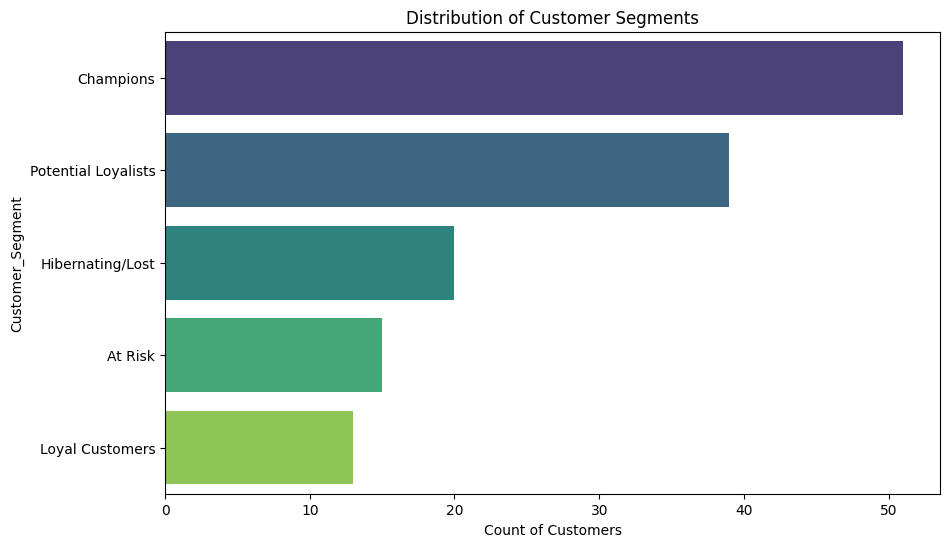
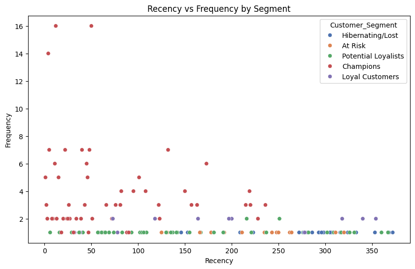
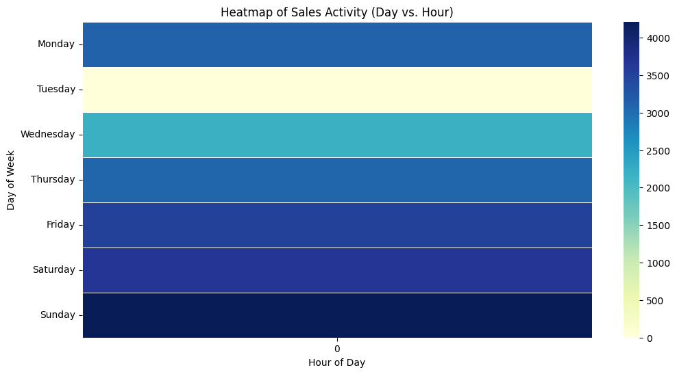
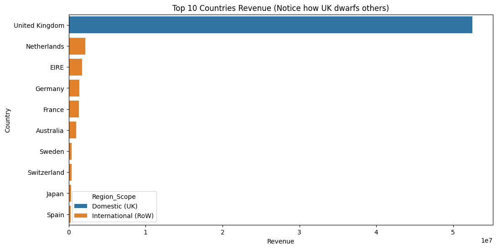
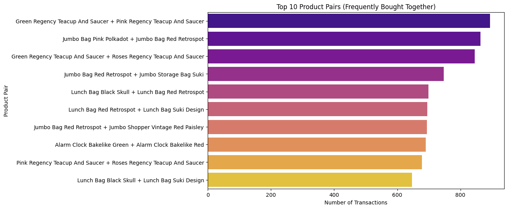

# E-commerce Customer Segmentation & Sales Performance 📊

An end-to-end data science project utilizing **RFM Analysis** to segment customers and **Time-Series Analysis** to uncover sales patterns for a UK-based online retailer.

## 📌 Project Overview
The goal of this project is to transform raw transactional data into actionable business intelligence. By categorizing customers based on their buying behavior and identifying peak sales periods, the business can optimize marketing spend and improve inventory management.

### Key Objectives:
* **Customer Segmentation:** Grouping customers into 5 distinct segments using RFM (Recency, Frequency, Monetary) scores.
* **Sales Performance:** Analyzing revenue trends, seasonality, and geographic distribution.
* **Product Analytics:** Identifying top-selling products and frequently bought item pairs (Market Basket Analysis).

---

## 🛠️ Tech Stack
* **Language:** Python 
* **Libraries:** Pandas, NumPy, Matplotlib, Seaborn
* **Tools:** Power BI, Jupyter Notebook
* **Dataset:** [Online Retail/E-commerce Sales (Kaggle)](https://www.kaggle.com/datasets/gabrielramos87/an-online-shop-business)

---

## 🔍 Key Insights & Visualizations

### 1. Customer Intelligence (Clustering & RFM)
Using K-Means clustering and RFM scoring, we identified distinct customer personas. This allows for targeted marketing (e.g., sending discount codes to "At Risk" customers).

> **Optimal Clusters (Silhouette Analysis)**
> We used the Silhouette Method to verify the mathematical separation of our segments.
> 

> **Customer Segment Profiles**
> This visualization shows the distinct behavior of each cluster based on their spending and frequency.
> 

---

### 2. Sales Performance & Trends
Analysis of transaction timestamps revealed critical operational windows and seasonal trends.

> **Operational Heatmap**
> Identifies peak footfall for a week to optimize server load and customer support.
> 

> **Geographic Revenue (UK vs. Rest of World)**
> By filtering out the UK "data skew," we can clearly see the performance of international markets like Germany and France.
> 

---

### 3. Product Analytics
Using the **Pareto Principle (80/20 Rule)**, we identified the "Vital Few" products that generate the majority of the store's revenue.

> **Market Basket Analysis**
> This chart identifies products frequently bought together, providing a roadmap for cross-selling and "Recommended for You" features.
> 

---

## 📊 Interactive Power BI Dashboard
The project concludes with a multi-page management dashboard.

### Page 1: Executive Summary
* Real-time KPIs for Total Revenue, AOV, and Active Customers.
* Revenue Trend lines with YoY growth.

### Page 2: Customer Deep-Dive
* Interactive slicers to view specific segment lists (e.g., "Show me all At-Risk customers").
* Treemaps visualizing revenue contribution by segment.

---

## 🚀 How to Run
1. Clone the repo: `git clone https://github.com/yourusername/ecommerce-rfm-analysis.git`
2. Install dependencies: `pip install -r requirements.txt`
3. Run the Jupyter Notebook `Analysis_Notebook.ipynb` to generate the cleaned CSVs.
4. Open the `Dashboard.pbix` file in **Power BI Desktop** to view the interactive visuals.

---

## 💡 Conclusion
The analysis reveals that **20% of the customer base (Champions & Loyalists)** contributes to over **60% of total revenue**. Moving forward, marketing efforts should focus on "At Risk" customers to prevent churn and personalized cross-selling for "Potential Loyalists."

---
**Author:** [Your Name]  
**Connect:** [Your LinkedIn Link]
